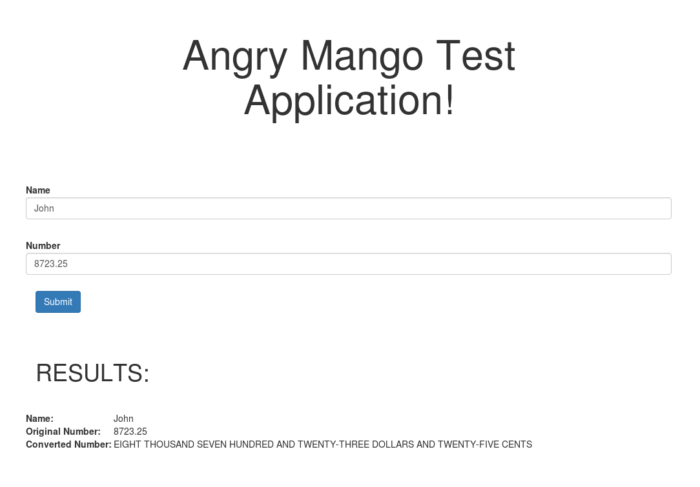
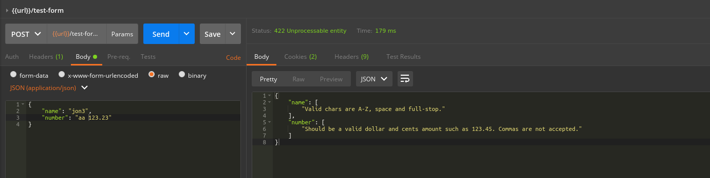
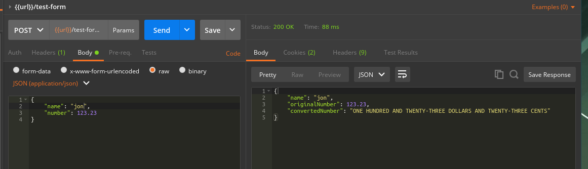

Angry Mango Test Application
===============================

This solution was built with the following technologies:
- Yii2 PHP framework
- Vagrant (with Virtualbox) development host
- Ansible to provision the webserver
- Webstack of Debian, Nginx, PHP7 and MySQL (MySQL not used)

This solution has been completed as a web frontend as well as a RESTful API endpoint.


INSTALLATION INSTRUCTIONS
-------------------

The installation with Vagrant needs the following packages installed on the host machine:
- Virtualbox
- Vagrant
- Ansible
- Python

Add line to /etc/hosts by typing
`echo '192.168.30.122 angrymango.test' | sudo tee -a /etc/hosts`

Add record to ~/.ssh/config (modify to match the path on your host machine.
~~~
Host angrymango.test
User vagrant
Hostname angrymango.test
IdentityFile /var/www/angrymango/.vagrant/machines/default/virtualbox/private_key
~~~

Startup virtual machine - change to the project's working directory: `vagrant up`.

Note: For some reason this Vagrant box doesn't have Python3 installed so we need to do it manually:
```
# ssh angrymango.test
# sudo apt-get update && sudo apt-get upgrade
# sudo apt-get install python3 -y
# sudo ln -s /usr/bin/python3 /usr/bin/python
```

Provision Vagrant machine: `dev/provision.sh local_dev`

ssh into Vagrant machine `ssh angrymango.test` and type:
~~~
composer global require "fxp/composer-asset-plugin:^1.1.4"
composer install
~~~

The site shouuld now load in your browser at `http://angrymango.test`


TEST INSTRUCTIONS
-------------------

Web browser: Point your browsert to `http://angrymango.test` and follow the link to to test form. Fill out the form and submit.

RESTful API. Either use Postman or cURL from the command line as such:
```
curl -X POST \
  http://angrymango.test/api/v1/test-form/test \
  -H 'cache-control: no-cache' \
  -H 'content-type: application/json' \
  -d '{
	"name": "jon",
	"number": 123.23
}'
```


TECHNICAL DESCRIPTION
----------------------
As I am applying for the role of backend developer I have not made any effort on the visual design of the application and just focused on functionality.

The code structure is classic MVC with the `SiteController` handling the input and output with the `TestModel` handling data validation and business logic. It would be easiest to check the [pull requests on Github](https://github.com/doublehops/angrymango-test/pulls?q=is%3Apr+is%3Aclosed) to see what files were created/changed and what changed within them. 

I was not sure if it was an expectation to include a library to make the float to English conversion but assumed one should be built from scratch. This was done in the model and the result is the effort of making to code clean, clear with as little code as possible without duplicating any code where possible. Validation has been included to help user input and prevent abuse. 

Comments have been added and PSR2 coding standards have been adhered to. No tests have been added for this as it would require more time to setup than I have right now. Gitflow methodology has been used to keep branching clear and make past work much easier to find and understand.




